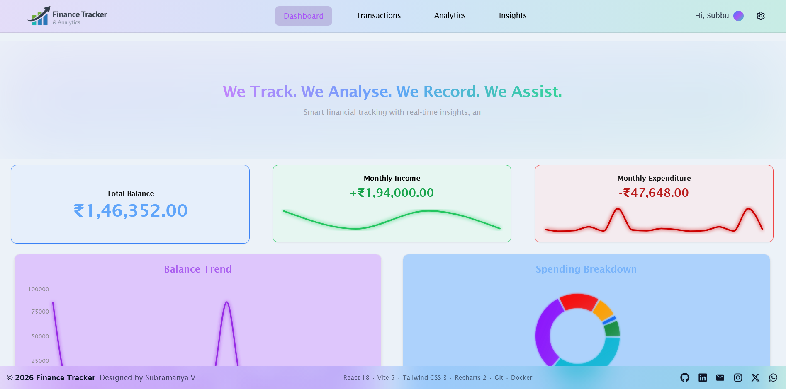
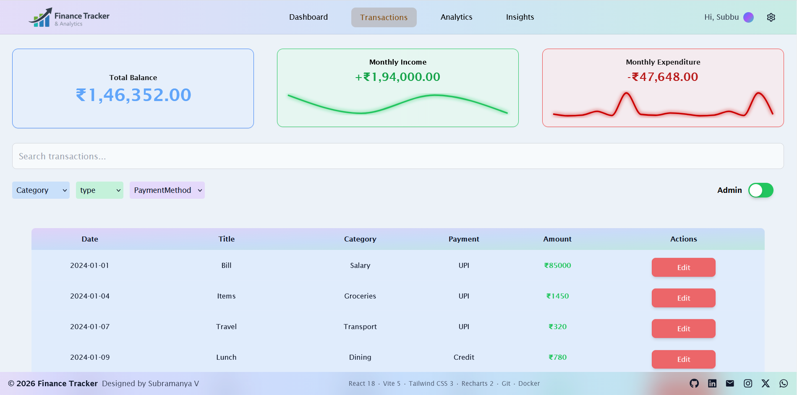
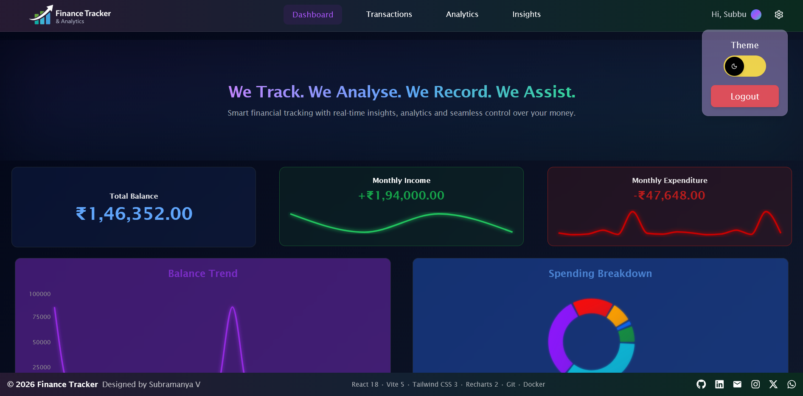

### 👋 Hello, I'm Subramanya Veeregowda
----

----

---
💻 **Full Stack Developer | Java Backend Enthusiast | Problem Solver**

I enjoy building scalable web applications, learning new technologies, and solving complex problems through clean and efficient code. My focus is on creating reliable backend systems while crafting modern and responsive frontends.

---

# 🚀 Finance Tracker & Analytics

---

## 📌 Overview

A modern *Finance Tracker & Analytics Dashboard* built to manage transactions, visualize financial data, and deliver smooth user experience through thoughtful UI/UX and performance optimization.

This project focuses on:
- Clean architecture
- Scalable component design
- Smooth animations and transitions
- Real-world state management patterns

---

## 🎯 Objective

To build a responsive and intuitive financial dashboard that:
- Tracks income and expenses
- Provides analytics insights
- Demonstrates strong frontend engineering practices

---

## 🔗 Live Demo

👉 *Demo Link:* [Add your deployed link here]

---

## 🖼️ Preview

### 💻 Desktop (Light Mode)

  

<<<<<<< HEAD
  
=======
  
>>>>>>> 5c39683 (ft: added proper documentation in readme about my project)

  

  

  

  

### 💻 Desktop (Dark Mode)

  

  
 
  

  

  

  

### 📱 Mobile (Light Mode)
> Add screenshot here

### 📱 Mobile (Dark Mode)
> Add screenshot here

---

## ✨ Features

### 📊 Core Features
- Transaction management
- Financial summary dashboard
- Analytics & insights visualization
- Role-based UI behavior (viewer/admin)

### 🎨 UI/UX Features
- Dark / Light theme support
- Smooth page transitions
- Responsive design (mobile + desktop)

### ⚡ Performance & Experience
- Global Skeleton Loader
- Controlled loading timing (UX optimization)
- Lazy rendering patterns

---

## 🎬 Animations & Interactions

- 🔄 Skeleton Loader with animated bars
- 📈 Animated Graph Loader (rising/falling bars)
- ✨ Fade-in transitions
- 💥 Burst animation effects
- ⌨️ Typewriter effect
- 🔁 Scroll-to-top behavior
- ↔️ Horizontal scrolling sections

---

## 🧠 State Management Approach

- Centralized global loading state using *React Context API*
- Local component state using useState
- Side effects handled via useEffect
- Optimized async handling using Promise.all

---

---

## 🧩 Pages

- *Dashboard*
  - Summary cards
  - Charts & analytics
  - Loader integration

- *Transactions*
  - List of transactions
  - Role-based editing

- *Analytics*
  - Data visualization
  - Graph insights

- *Insights*
  - Financial trends
  - Behavioral analytics

---

## 🧱 Components

### 🔹 UI Components
- Cards (Balance, Income, Expense)
- Charts (Bar, Donut, Line)
- Toggle (Theme switch)

### 🔹 Utility Components
- ScrollToTop
- RoleToggle
- HorizontalScroll

### 🔹 Loader Components
- SkeletonLoader
- AnimatedBars
- Global Loading Context

---

## 🧪 Technical Quality

- Modular component structure
- Reusable UI components
- Clean separation of concerns
- Scalable folder organization
- Optimized async operations

---

## 🧠 Methods & Practices Used

- Component-driven architecture
- Context-based global state
- Async data fetching with batching
- UX-first loading strategies
- Responsive-first design approach

---

## ⚙️ Installation & Setup

### Clone repository
git clone <your-repo-url>

### Navigate
cd finance-tracker

### Install dependencies
npm install

### Run locally
npm run dev

---

--- 

